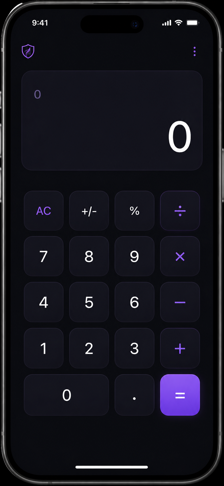
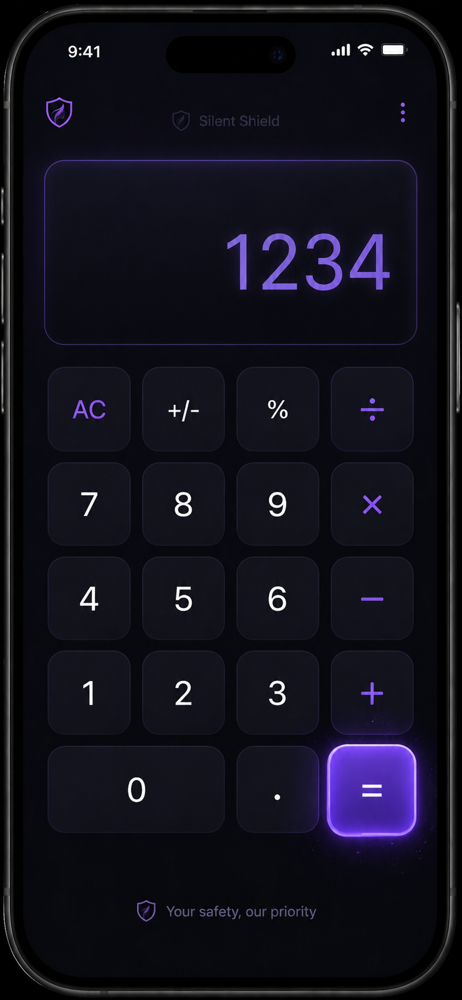
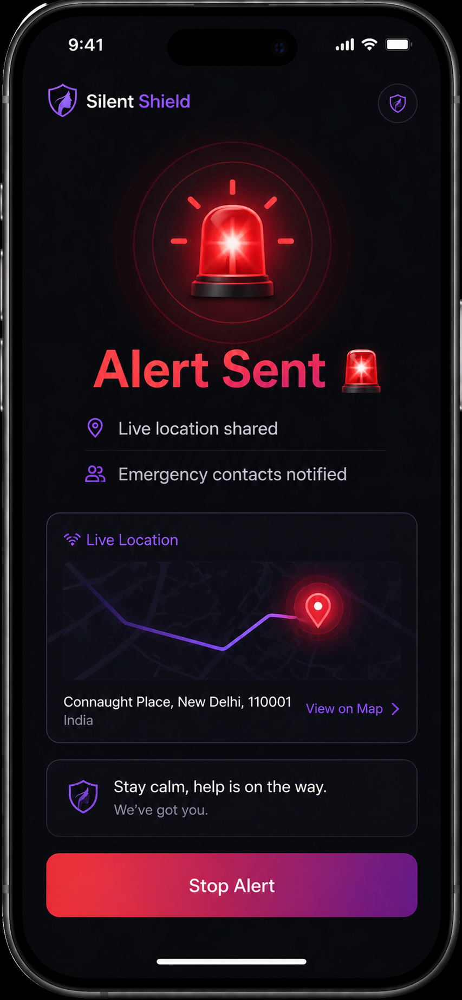
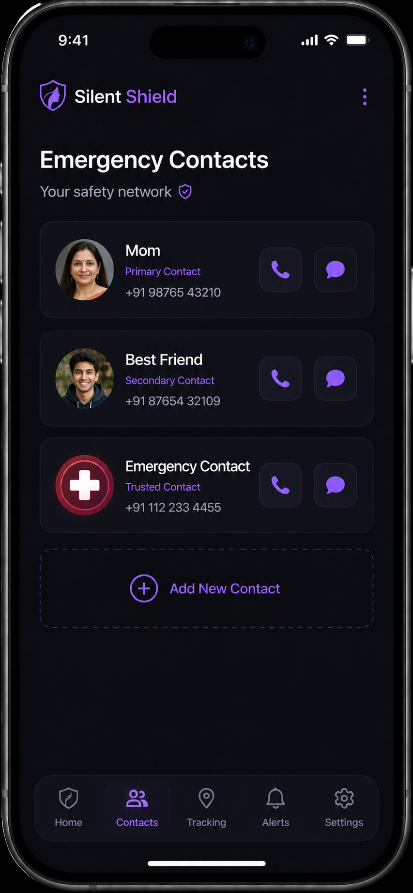
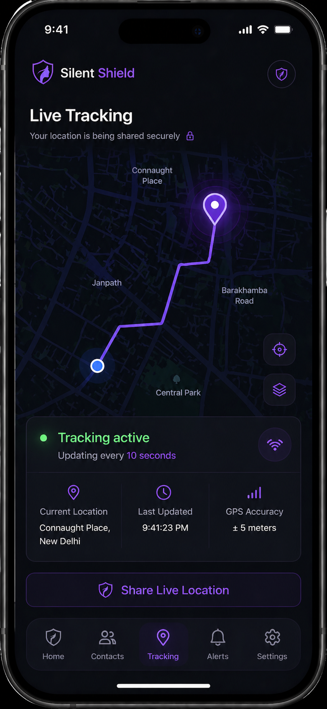
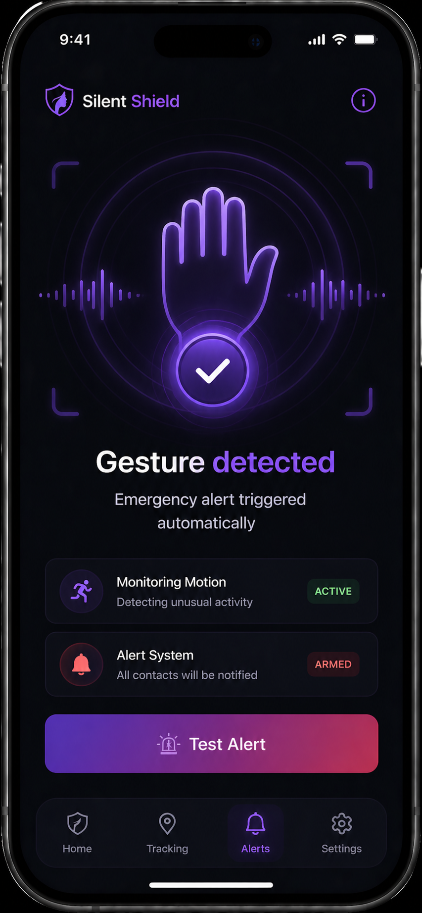

# Silent-Shield
💡 Problem
In dangerous situations, victims cannot openly use safety apps. Attackers may notice or even take the phone, stopping any alert system.

 🚀 Solution
Silent Shield is a hidden emergency system disguised as a normal app (calculator). It allows users to secretly trigger SOS alerts and continues working even after device loss.

🔥 Features
- Hidden calculator interface
- Secret SOS trigger (1234 =)
- Danger Mode for continuous tracking
- Motion-based auto trigger (concept)
- Background alert system
- Cloud-based data backup (concept)

 🛠 Tech Stack
- HTML, CSS, JavaScript
- Firebase 
- Motion Sensors 

 🌍 Future Scope
- AI-based detection
- Wearable integration
- Police system integration

  📱 UI Flow Prototype

1. Hidden Calculator Interface

2. Secret Code Trigger (1234 =)

 3. SOS Activated

 4. Emergency Contacts

5. Live Tracking

6. Gesture Detection

